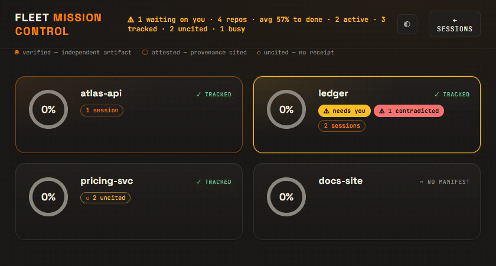

# Fleet — terminal AI session monitor

[](https://github.com/DogmaLabsTech/fleet/actions/workflows/ci.yml)
&nbsp;
&nbsp;
&nbsp;

**One window over every running terminal AI coding session — Claude Code, Codex,
Gemini, and Qwen — and an honest ring per repo that won't pretend work is done
when it isn't.** 100% local; nothing leaves your machine.



*Mission Control: one ring per repo, split into **verified** (an independent
artifact backs it) / **attested** (a cited receipt) / **uncited** (no receipt) —
and flagged **contradicted** when a `done` claim's receipt is missing.*

See, supervise, and inspect every running AI coding session from one window — the
live table, what each session has in its head, which files it touched, and how its
work connects to your Obsidian vault. Claude Code is supported in full; **Codex,
Gemini CLI, and Qwen Code** are read through provider adapters (see
[`docs/PROVIDERS.md`](docs/PROVIDERS.md)).

## 100% local. Nothing leaves your machine.

Fleet reads **only your own local files** — each tool's own session state and
transcripts (`~/.claude`, `~/.codex`, `~/.gemini`, `~/.qwen`), and (optionally) an
Obsidian vault you point it at.

- The server binds **`127.0.0.1` only**, with Host-header and CSRF guards.
- **No network egress. No telemetry. No analytics.** Fonts are self-hosted.
- The only actions are opening a file/folder/page (hand-off to your OS) and
  ending a session (confirm-gated, with a PID-reuse guard). Fleet never writes to
  `~/.claude` or your vault.

## Mission Control & the honesty rings

Beyond the live session monitor, Fleet has a **Mission Control** view: a ring per
project showing how far it is to done — and, crucially, **how trustworthy that
number is.** One file per repo, `<repo>/.fleet/progress.json`, lights up the ring,
split into three honesty arcs:

- **verified** — a `done` milestone whose `verify` block points at a real repo
  artifact that Fleet read and confirmed;
- **attested** — a milestone with a cited receipt (commit / PR / branch) taken on
  trust;
- **uncited** — a bare assertion with no receipt (and `contradicted` flags any
  `done` claim whose artifact is missing).

A ring can't silently lie: green that means *verified* and green that means *I said
so* are coloured differently. And the trust boundary is the same as the rest of the
tool — **Fleet decides every tier by reading local files only. It never executes
anything to verify** (no tests run, no build, no shell, no network); every path is
sandboxed to the repo root.

Adopt it in one file:

```bash
fleet init                 # scaffold .fleet/progress.json in the current repo
fleet projects add <path>  # pin a repo to Mission Control
fleet dash                 # then switch from the sessions monitor to Mission Control
```

- [`docs/HONESTY.md`](docs/HONESTY.md) — the verified / attested / uncited /
  contradicted doctrine, and why Fleet reads but never runs.
- [`docs/PROGRESS-MANIFEST.md`](docs/PROGRESS-MANIFEST.md) — the
  `.fleet/progress.json` schema reference, with a worked example.
- [`docs/ADOPTING.md`](docs/ADOPTING.md) — fill the sidecar by hand or have your
  coding agent maintain it.

The sessions monitor stays the default view; Mission Control is opt-in via the
switcher.

## Give your AI a memory

Fleet can also scaffold a **knowledge vault** — a plain-markdown folder your coding
agent reads and writes as long-term memory. From the repo (or any folder) you want
your AI to remember:

```bash
fleet init-vault          # scaffold the current folder as a vault
fleet init-vault ./brain  # …or a subfolder
```

It writes a `CLAUDE.md` that **points your AI at the vault**, plus a `wiki/` skeleton
(index, log, conventions, a seed domain folder) and a few note templates — no-clobber,
and it never overwrites an existing `CLAUDE.md` (the contract goes to a sidecar to
merge). Launch `claude` in that folder and your agent treats `wiki/` as its memory.

That makes the AI *use* the vault. To make the vault **self-building and searchable**
— auto-ingest sources, lint links, local retrieval — install the engine it's designed
around, the MIT-licensed
[`claude-obsidian`](https://github.com/AgriciDaniel/claude-obsidian) plugin by
AgriciDaniel:

```
/plugin marketplace add AgriciDaniel/claude-obsidian
```

Fleet ships only the generic skeleton (your own files — nothing third-party). The
engine, and Obsidian's desktop GUI, are optional installs you control; retrieval
defaults to local BM25, so no model download is required and nothing leaves your
machine.

## Providers — more than Claude Code

Fleet reads each terminal AI agent through a small **provider adapter**. Any
detected tool is included automatically; pin a set with `FLEET_PROVIDERS=claude,codex`.

| Provider | Reads | Live status |
|---|---|---|
| **Claude Code** | `~/.claude/sessions` + transcripts | **verified** (live PID + busy/waiting/idle) |
| **Qwen Code** | `~/.qwen/projects/**/chats` + `*.runtime.json` | **verified** (real PID from the runtime sidecar) |
| **Codex CLI** | `~/.codex/sessions/**/rollout-*.jsonl` | *inferred* from recent activity |
| **Gemini CLI** | `~/.gemini/tmp/**/chats/session-*.jsonl` | *inferred* from recent activity |

**An honesty line, not a feature gap:** only Claude Code and Qwen write a live
status/PID file, so only they can report *verified* running/waiting state. Codex
and Gemini expose an after-the-fact transcript, so Fleet marks those sessions
`~live (inferred)` from how recently they were written — never dressed up as a
precise busy state it can't actually know. Adding a provider is one small module;
see [`docs/PROVIDERS.md`](docs/PROVIDERS.md).

## Install

```bash
pip install fleet-cc          # core (terminal + browser dashboard)
pip install "fleet-cc[app]"   # + native desktop window (pywebview)
```

## Use

```bash
fleet          # compact table of live sessions in your terminal
fleet dash     # live dashboard in your browser at http://127.0.0.1:8377
fleet app      # native desktop window (needs the [app] extra)
fleet --json   # raw collector output (debugging)
```

Click a session for three tabs: **HEAD** (context size, loaded rules, files
read/edited, skills/agents/MCP used), **VAULT WEB** (Obsidian pages it touched +
their wikilinks — set `FLEET_VAULT_DIR` to your vault), **TIMELINE** (what it did).

## Platforms

macOS, Linux, Windows. The terminal table and browser dashboard need no GUI
toolkit; the native window (`fleet app`) uses pywebview (built in on macOS/Windows;
on Linux install a Qt or GTK backend, or just use `fleet dash`).

## Caveat

Fleet reads each agent's **internal, undocumented** on-disk state. It's
best-effort and fail-soft: a format change in a future CLI release may show less
detail until Fleet catches up, but it will not crash. (Gemini's log format in
particular is mid-migration, so its adapter is the most provisional.) Issues and
PRs welcome.

## Configuration

| Env var | Meaning |
|---|---|
| `FLEET_PROVIDERS` | Comma-separated providers to read (e.g. `claude,codex`); default: every detected tool |
| `FLEET_CLAUDE_DIR` | Override `~/.claude` (default) |
| `FLEET_CODEX_DIR` | Override `~/.codex` (also honors `CODEX_HOME`) |
| `FLEET_GEMINI_DIR` | Override `~/.gemini` |
| `FLEET_QWEN_DIR` | Override `~/.qwen` (also honors `QWEN_HOME`) |
| `FLEET_VAULT_DIR` | Your Obsidian vault root (enables the VAULT WEB tab) |
| `FLEET_OBSIDIAN_JSON` | Override the Obsidian registry path |
| `FLEET_PROJECTS_JSON` | Mission Control project pins (`{slug: repo_path}`); defaults to your per-OS config dir |

## License & credits

MIT — see [`LICENSE`](LICENSE). Built by [Dogma Labs](https://github.com/DogmaLabsTech).
Contributions welcome; please open an issue or PR.
